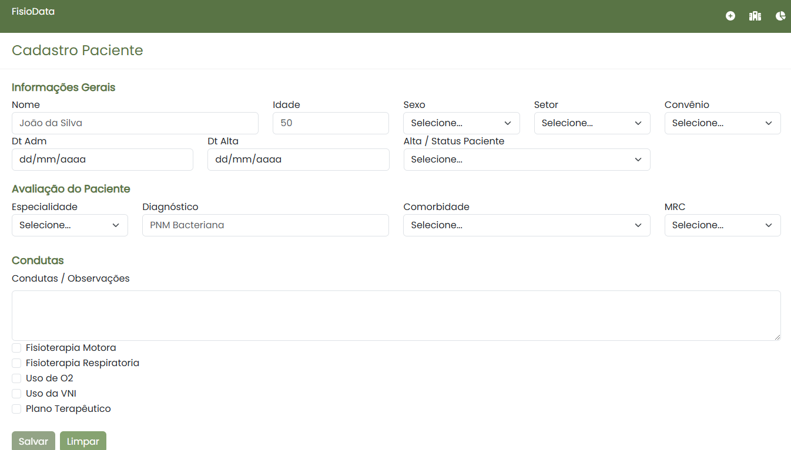
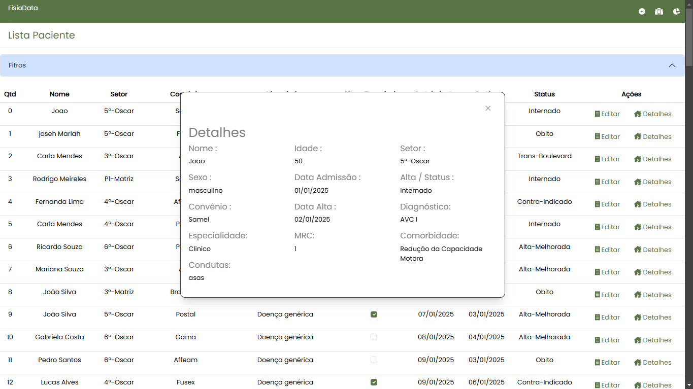
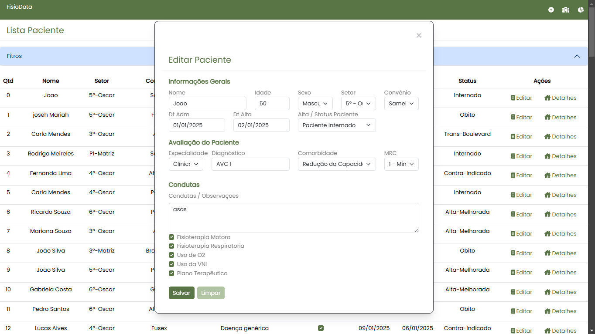
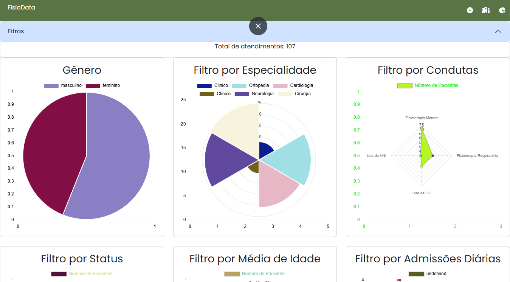
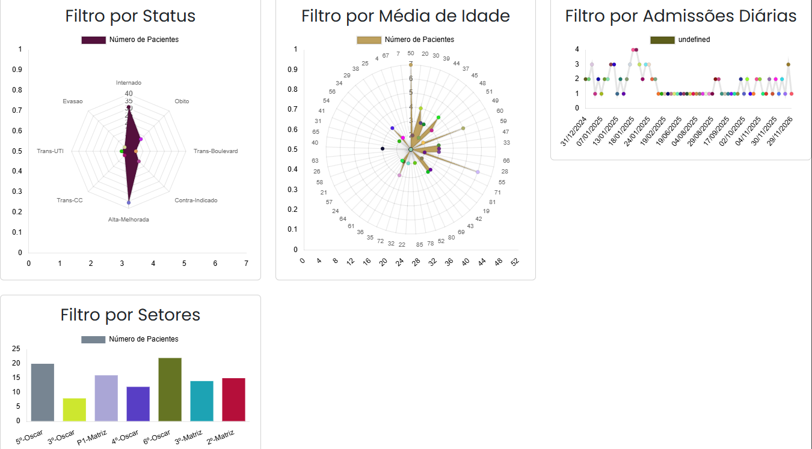

# FisioData v 1.0

📌 Sobre o Projeto
- O FisioData é um sistema desenvolvido para facilitar o acompanhamento de pacientes da equipe de fisioterapia hospitalar, proporcionando uma gestão eficiente de informações, registro de evoluções, monitoramento e relatórios com gráficos em tempo real.

## 🚀 Funcionalidades

🔎 Cadastro, Edição e Pesquisa de Pacientes: Registro completo com histórico clínico e dados de internação.

📊 Geração de Relatórios: Análises sobre a evolução dos pacientes e eficácia dos tratamentos.

🔄 Filtros e Busca Avançada: Filtragem por status de alta, setor e datas de internação e etc.

🛠️ Tecnologias Utilizadas

Frontend: Angular

Backend: FAKE DB Json-Server _(BackEnd em .NEt em desenvolvimento)_

Banco de Dados: MySQL Server _(Em desenvolvimento)_

Outras: TypeScript, Bootstrap, PrimeNG

## 📖 Como Executar o Projeto

### 1️⃣ Clone o Repositório

```
git clone https://github.com/MeirelesRodrigo/FisioData.git
cd fisioData
```
### 2️⃣ Instale as Dependências

```
npm install
```

### 3️⃣ Execute Json-Server

```
json-server --watch db.json
```

Acesse no navegador: `http://localhost:4200/`

---

## 🎯 Telas do sistema
### Login


### Cadastro


### Detalhes


### Edição


### Gráficos




### 1️⃣ Próximas Atualizações
- Integração com Backend .Net (C#)
- Persistencia de dados com MySql
